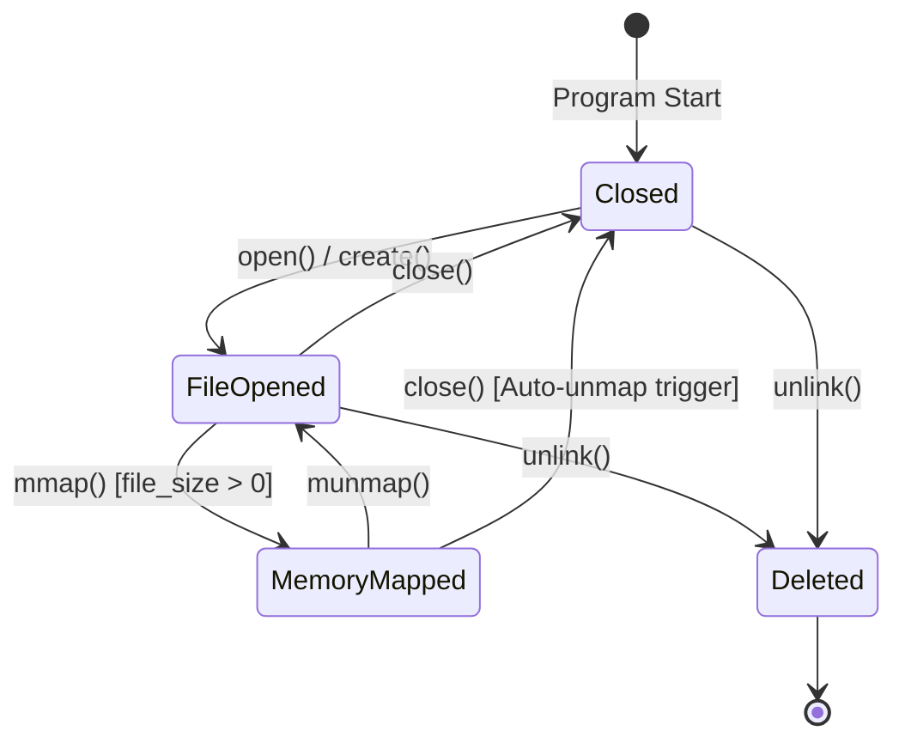
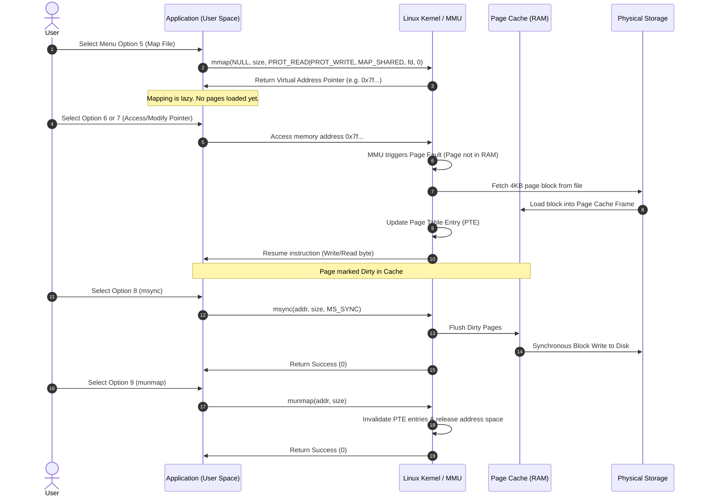

# System Design & Architecture Document

## Linux Memory-Mapped File Management System

---

## 1. System Architecture Overview

The system bridges user space application logic with Linux kernel virtual memory subsystems using standard POSIX system calls.

```
+-----------------------------------------------------------------------+
|                         USER SPACE PROCESS                            |
|                                                                       |
|  +-----------------------------------------------------------------+  |
|  |             CLI Menu & State Controller (main.c)                |  |
|  +-----------------------------------------------------------------+  |
|            |                        |                       |         |
|            v                        v                       v         |
|  +------------------+     +------------------+    +-----------------+ |
|  | File Descriptor  |     | Virtual Memory   |    | Memory Pointer  | |
|  |  State (fd)      |     |  Address Pointer |    |  Dereference    | |
|  +------------------+     +------------------+    +-----------------+ |
+-----------------------------------------------------------------------+
             |                        |                       |
====== SYSTEM CALL INTERFACE (POSIX System Call Boundary) ==============
             |                        |                       |
             v                        v                       v
+-----------------------------------------------------------------------+
|                         LINUX KERNEL SPACE                            |
|                                                                       |
|  +--------------------+   +--------------------+  +-----------------+ |
|  | Virtual Memory     |   | Page Table Entry   |  | Inode & File    | |
|  | Subsystem (VMA)    |   | (PTE & MMU Fault)  |  | System Manager  | |
|  +--------------------+   +--------------------+  +-----------------+ |
|            |                        |                       |         |
|            +------------------------+-----------------------+         |
|                                     |                                 |
|                                     v                                 |
|                        +------------------------+                     |
|                        | Page Cache (Dirty Pages)|                    |
|                        +------------------------+                     |
+-----------------------------------------------------------------------+
                                      |
                                      v
+-----------------------------------------------------------------------+
|                         PHYSICAL STORAGE                              |
|                          (Block Device / Disk)                        |
+-----------------------------------------------------------------------+
```

---

## 2. Process Virtual Memory Layout

When `mmap()` is executed with `MAP_SHARED`, Linux allocates space in the process's Virtual Memory Address space between the Heap and Stack (the Memory Mapping Segment):

```text
High Address  +-----------------------------------+
              | Kernel Space (Forbidden to User)  |
              +-----------------------------------+
              | User Stack (Local variables)      |
              |                |                  |
              |                v                  |
              |                                   |
              | Memory Mapping Segment            |
              |  [mmap Address: 0x7f...] --------+--> Mapped File Pages
              |                ^                  |    (PROT_READ | PROT_WRITE)
              |                |                  |
              | Heap (malloc / dynamic memory)    |
              +-----------------------------------+
              | Uninitialized Data (.bss)         |
              +-----------------------------------+
              | Initialized Data (.data)          |
              +-----------------------------------+
              | Text Segment (Executable Code)    |
Low Address   +-----------------------------------+
```

---

## 3. Finite State Machine (FSM) Design

The system enforces strict state transition rules to ensure safety and prevent kernel exceptions or dangling memory references:



### State Guard Rules:
1. **Zero-Length Mapping Guard:** `mmap()` cannot be called on files where `file_size == 0`. The user must extend file size via `ftruncate()` or write data first.
2. **Resizing Guard:** `ftruncate()` on an active mapping triggers an automatic `munmap()` first to prevent `SIGBUS` faults.
3. **Closing Guard:** Invoking `close()` while `is_mapped == 1` automatically invokes `munmap()` before closing the file descriptor.

---

## 4. Detailed Memory-Mapping Sequence Diagram



---

## 5. Security & Safety Design Principles

1. **Bounds Validation:** All memory modifications compute remaining length `(mapped_size - offset)` to prevent buffer overflows or segmentation faults (`SIGSEGV`).
2. **Safe Input Processing:** `fgets()` and custom numeric parsing (`strtol()`) are used throughout to prevent buffer overflow attacks inherent in `gets()` or `scanf()`.
3. **Resource Leak Prevention:** Global `cleanup()` handler guarantees unmapping and descriptor closure on program termination.
